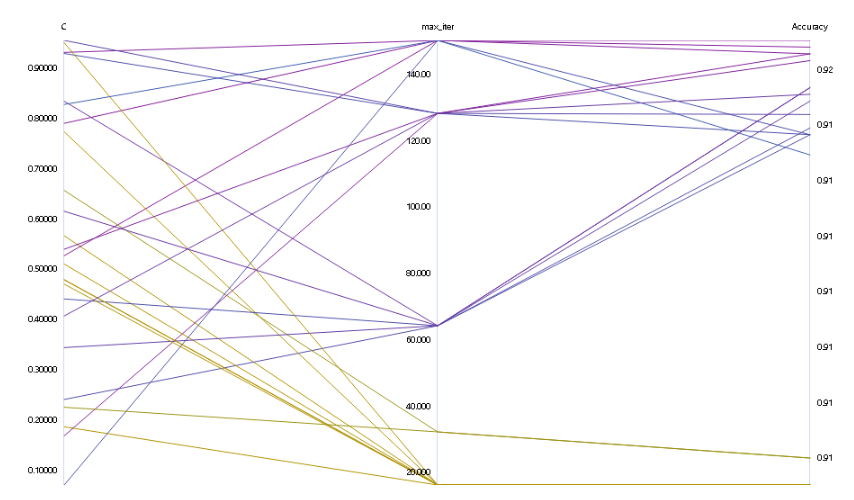

# Optimizing an ML Pipeline in Azure

## Overview
In this project we build and optimize an Azure ML pipeline using the Python SDK and a provided Scikit-learn model.
This model is then compared to an Azure AutoML run.

## Summary
The dataset used for this project is a 

The best performing solution comes from AutoML. 

## Scikit-learn Pipeline
The Logistic regression pipepline begins by parsing the data in a Tabular Dataset for Azure. Next, the data is pre-processed and cleaned. Sklearn train test split is used and finally the Logistic regression model is applied to the training data. Since this is a classification problem, accuracy is used as a metric. Then, Azureml hyperdrive is used to perform hyperparameter tuning.

Hyperdrive is configured with a Random parameter sampling and a Bandit policy for termination. 

The sampling strategy is helpful as it doesn't perform an exhaustive, greedy approach rather samples hyperparameters randomly from a parameter search space. This has the advantage of faster speed and performance that can be as good as an exhaustive search.

Our choice of early stopping is a bandit policy which ends a job when the primary metric isn't within the specified slack factor/slack amount of the most successful job. This also allows to speed up the tuning process and reduces cost. 


## AutoML
AutoML model chose a VotingEnsemble comprised of 10 models. Each model is combined with a scaler or a normalizer. These models are LightGBM, XGBoost, SGD and Logistic regression. 

## Pipeline comparison
**Compare the two models and their performance. What are the differences in accuracy? In architecture? If there was a difference, why do you think there was one?**

The hyperparameters of logistic regresison are optimized by HyperDrive which resulted in an accuracy of 0.91527. The hyperparameters are : 
```
Max Iterations : 128
Regularization strength : 0.167
```


The best accuracy from AutoML comes from the VotingEnsemble with an accuracy of 0.91818. The architecture of this ensemble contains 6 XGBosst, 2 LightGBM, 1 Logistic and 1 SGD. The highest ensemble weights are assigned to XGBosst and LightGBM and the rest of the models have similar weights.

## Future work
Feature engineering is a big area of improvement which can help in improving the performance. Model tuning can also be combined with feature selection that can help make the model simple and more interpretable and can also improve the model metrics.


## Proof of cluster clean up
**If you did not delete your compute cluster in the code, please complete this section. Otherwise, delete this section.**
**Image of cluster marked for deletion**
